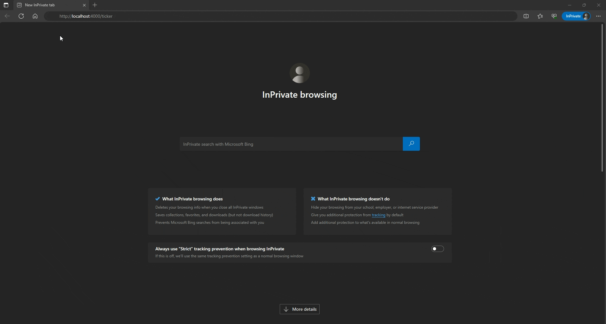

# Simple Project

Create a Phoenix project without a database

```bash

mix phx.new dazzle --no-ecto

...

Fetch and install dependencies? [Yn] Y
* running mix deps.get
* running mix assets.setup
* running mix deps.compile

We are almost there! The following steps are missing:

    $ cd dazzle

Start your Phoenix app with:

    $ mix phx.server

You can also run your app inside IEx (Interactive Elixir) as:

    $ iex -S mix phx.server

```

# Render a basic LiveView Page
LiveViews hold the state in a Socket and to access the map of data use `assings`

To render a basic LivewPage we need to create a new Module with the only one required function `render/1`

create the file `ticker_live.ex` under `lib\dazzle_web\live`

```elixir
defmodule DazzleWeb.TickerLive do
  use DazzleWeb, :live_view

  def render(assigns) do
    ~H"""
      Hello LiveView
    """
  end
end

```

Update the Router where we need to configure the URL pattern and the code that will 
handle the LiveView code. Open the file `router.ex` and add the following line to specify 
a `live` route that maps the `ticker` URL pattern to the module `TickerLive`

```elixir
    live "/ticker", TickerLive
``` 
to 
 
```elixir
  scope "/", DazzleWeb do
    pipe_through :browser

    get "/", PageController, :home
  end

```

Run the code with 
```bash
mix phx.server
```

Open the browser with `http://localhost:4000/ticker` and you will see `Hello`


# Add state with mount/3

Add the `mount` function to set the state. This is the first function called after loading the route.

```elixir
  def mount(_param, _session, socket) do
    {:ok, assign(socket, count: 0)}
  end
```
The function add the key `count` with the value `0`. Now we can use it in the `render/1`, to access the
key in the `socket.assigns` map we can use the syntax suggar `@key_name` in this case `@count`. 
That's the same as `assings.count`

Updated the render function to access the key `count`
```
    <h1>Dazzle count: <%= @count %></h1>
```

The chapter shows how to extract blocks of HTML code as components 
written in Elixir functions.
The pattern is

```html
   <.function_name arg_1="value", arg_2="value"/>
```

# Send a Recurring Tick 
Events will going to change our data.
Every time a messages comes in, LiveView will invoke the corresponding handler, which will update the state,
triggering a new render to display the HTML.


We use `handle_info` that will be called each time the Elixir process sends a message
using the Earlang `:timer`

- We update the count and rotate the text in both directions.
- We scroll text in both directions.
- We also shows the current time.

